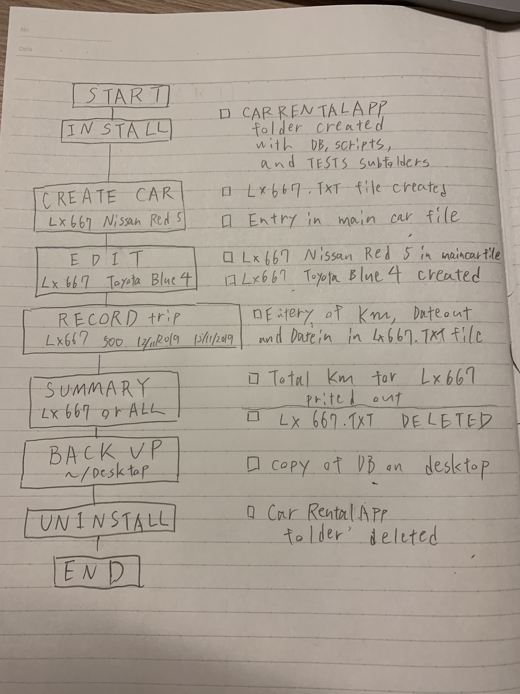
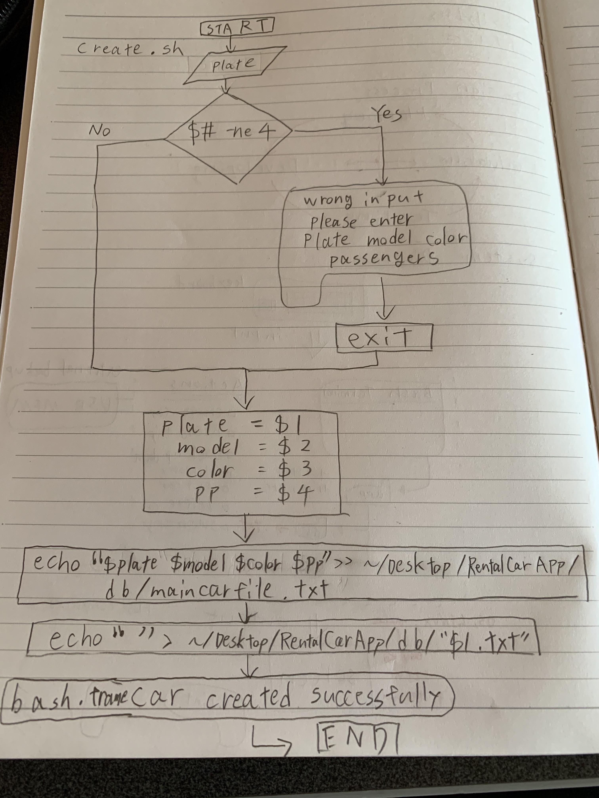
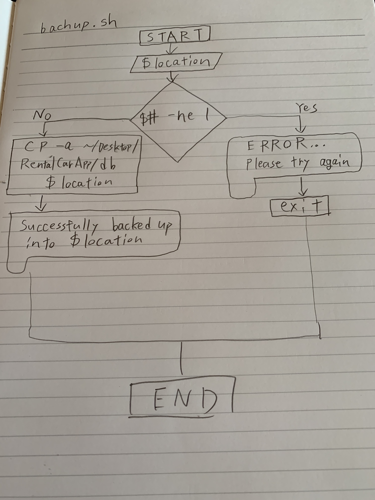

Car Rental Minimal App
===========================

A car rental management minimal app in Bash.

Contents
-----
  1. [Planning](#planning)
  1. [Design](#design)
  1. [Development](#development)
  1. [Evalution](#evaluation)

Planning
----------
** Defining the problem (Topic 1.1.1)**
100-150 words explaining the context of the problem

I felt before we make this app, we should identify what does "simple based program". I mean to what extent should it be simple.   Unless we identify the world, programmer might be struggling how to simplify the code.

Secondable, when you correct the trip history with the place name, the data probably become wrong because in the case that customers uses a ferry to go across the ocean and park your car on it, the distance might be diffrent from actual one.

Third, if you want to make the file deletable, you should make a autmatical back-up system which automatically save the data after you edit it. 

### Solution proposed
Rationale for proposed solution

I decided that choosing bash would be the best solution for Car rental app because bash is a kind of shells cript and it can be made in terminal which is really familiar with us and also even if you use windows you can download it easily.
And it is easy to understand the structure for beginners.


### Success Criteria
This are measurable outcomes
1. A car can be created and stored in the database 
1. A car information can be edited 
1. A car can be deleted from the database
1. The installation is ***simple-> one step process***.
1. A summary (total/average distance traveled) can be generated for a particular car
1. Trips can be recorded and stored for an existing car
1. A basic database system is implemented
1. A basic backup functionality is avialable.

Design
---------
### First sketch of the system


This is the testing plan


Development
--------
### 1. Script to install the app
The following script creates the folder structure
1. Move to Desktop
1. Create file "RentalCarApp" and go inside
1. Create db and scripts file inside

```
#!/bin/bash

#This file creates the folder structure for the 
#minimal Car Rental App

echo "Starting the installation"
echo "Press enter to continue installation"

read 

#moving to the desktop
echo "Files will be created in DESKTOP"
echo "moving to desktop"

#Check for correct change directory
cd ~/Desktop

#Create App folder
mkdir RentalCarApp 

cd RentalCarApp

#Create folder for database and scripts
mkdir db 
mkdir scripts

bash frame.sh "structure created successfully"
exit
```
### 2. script to uninstall the app
The following script delete the file of app
1. get input from user (do you want to uninstall yes or no)
1. if it's yes, remove the app
1. if it's no, just exit

flow diagram for unistall.sh


```
#!/bin/bash
#This program uninstalls the app
echo "Would you like to uninstall CarRentalApp? Type yes or no and press enter"
read cho
if [ $cho == yes ]; then
	echo "Uninstalling file"
	rm -r ~/Desktop/CarRentalApp/
	bash frame.sh "UNINSTALLED SUCCESSFULLY"
else
	echo "The file will be not uninstalled"
	exit
fi
```
### 3. script to create car and its file
The following script creates car and its txt file
1. get input from user(license plate, model, color, passengers)
1. record the sentence in maincarfile.txt
1. create car file

flow diagram for create.sh

```
#!/bin/bash
# sep 30
#This program is for creating and recording about cars

if [ $# -ne 4]; then
	echo "Wrong input. Please enter Plate Model Color Passsengers"
	exit 1
fi

#number of arguments is correct. Continue
plate=$1
model=$2
color=$3
pp=$4

#adding new entry to file maincarfile.txt
echo "$plate $model $color $pp" >> ~/Desktop/RentalCarApp/db/maincarfile.txt
echo "" > ~/Desktop/RentalCarApp/db/"$1.txt"
bash frame.sh "Car created successfully"
```
### 4. script to record the car info in its file
The following script records car info in its file
1. get input from user(license plate, km, dateout, datein)
1. move to database
1. check if the info exits
	if it does, record it in $plate.txt
	if it doesn't, exit
```
#!/bin/bash
#This program is for recording the trip data
#Write the data into main

plate=$1
km=$2
dateout=$3
datein=$4

#moving to creation folder
cd ~/Desktop/RentalCarApp/db/

#get 4 arguments and check if the exits and record the data in it
if [[ ($# -ne 4) ]];then
    echo "Input is wrong, please type Plate, kilometers, dateout and datei. Please try again"

elif [ ! -f "$1.txt" ];then
    echo "The file don't exist, please create a car file first"

else
    echo "$plate $km $dateout $datein" >> $plate.txt
    echo "Trip data was successfully recorded"
fi
```
### 5. script to delete car and its file
The following script deletes car and its file
1. get input from user(license plate)
1. check if the car file exits
	if it does, show remove the file
	if it doesn't, show "please try again"
1. delete the line includes the licensse plate in maincarfile.txt
```
#!/bin/bash

#This program is for deleting a single car file

#moving to database file
cd ../db/

#check that argument was provided
#get argument of plate and check if it exits and delete the car file
plate=$1

if [[ ($# -ne 1) ]];then
	echo "Input is wrong, please type Plate again"
elif [ ! -f "$1.txt" ];then
	echo "The file don't exis. Please try again"
else 
	rm $1.txt
	bash frame.sh "The file was successfully deleted"
	#delete whole line which includes the plate
	sed -i '' "/$1/d" maincarfile.txt
	bash frame.sh "The car information was successfully deleted"
fi
exit 
```
### 6. script to edit the car info
The following script edits car info
1. get input from user(license plate, model, color, passengers)
1. check if $license.txt exists
	if it doesn't, exit
1. delete the sentence includes the license plate
1. record new car info
```
#!/bin/bash
#This program edit the information of an exiting car in the maincarfile
#user enters [license plate] [model] [color] [pp]

if [ $# -ne 4 ]; then
	echo "Error with the number of arguments"
	echo "Enter License plate, Model, Color, Passengers"
	exit
fi

license=$1
model=$2
color=$3
pp=$4

cd ../Database

if [ ! -f "$license.txt" ]; then
	echo "File not found!"
fi

#find the line with the given car plate and delete it
sed -i '' "/$license/d" maincarfile.txt
#add the new information
echo "$license $model $color $pp" >> maincarfile.txt
cd ../scripts
bash frame.sh "CAR EDITED SUCCESSFULLY"
```
### 7. script to summarize total km for one and all cars
The following script summarize total km for one and all cars
1. move to database
1. check if the argument user typed is right
	if it doesn't, exit
1. calculate km for all cars ttyped as arguments
1. check if $file.txt exists
	if it doesn't, exit
1. calculate km for one car
```
#!/bin/bash
#This program adds kilometers in car.txt file

#moving to right location
cd ..
cd db
#checking arguments user typed is right
if [$# -ne 1]; then
    echo "plese type license plate"
        ls
    exit
fi

file=$1

#show total distance for all cars user typed as arguments
if [ $file == all]; then
    #calculating total distance
    total=0
    #this loops through all the txt files in folder
    for f in *.txt;
    do
    #this is for avoiding maincarfile.txt
    if [[ ($f == "maincarfile.txt") ]]; then
        continue
    fi

    while read line;
    do
        #for loop for going through line word by word
        for km in $line
        do
            (( total=$km+$total ))
            break
        done
    done < "$f"
done

#show the results with frame
cd ..
cd scripts
bash frame.sh "TOTAL DISTANCE TRAVELED BY ALL CARS: $total"
exit

elif [ ! -f "$file.txt" ]; then
    echo "File for car $file does not exist"
    exit
fi

#calculating total distance for one car
total=0
#while loop for reading the file
while read line;
do
    #for loop for going through line word by word
    for km in $line
    do
        (( total=$km+$total))
        break
    done
done < "$file.txt"

#show the results with frame
cd ..
cd scripts
bash frame.sh "TOTAL DISTANCE TRAVELED BY $file: $total"
```
### 8. script to backup the app
The following script backups the app
1. get input from user(desired location)
1. check if the argument user typed is right 
	if it does, copy the app and paste it on desired locaiton
	if it doesn't, exit

flow diagram for backup.sh

```
#!/bin/bash

#This program backups the database folder in the MinimalCarRentalApp

location=$1

#check if argument user typed is one digit
if [[ $# -ne 1 ]]; then
	echo "ERROR... Please try again"
	exit
else
	#copy database
	cp -a ~/Desktop/RentalCarApp/db $location
	echo "Successfully backed up into $location"
fi
```

Evaluation
-----------
Test 1:
First run of the test file was unsuccessful because the Database folder was not existent.  
Also the create program did not store the license file inside the Database folder.  Changing the line `echo " " > $license.txt to `echo 
```.sh
cd ../
```
This is necessary because the `create.sh` resides in the ain folder whereas the test file is inside the /tests folders.
To check that the car was created in the main file (maincarfile.txt), the folowing command is used `lastLine = $( tail -n 1 Database/maincarfile.txt )` which is used for setting the last line at the end of the file in valuable.
`""` is used for recognizing itself as one sentence

**Summary:** 
What types of test we did today is that White-box testing.  We firstly create the demo file for testing and then create the program for checking if the file exists or not. And after that, check if the car file was actually added to to the main file by comparing the last line of main file and content of car file.   


